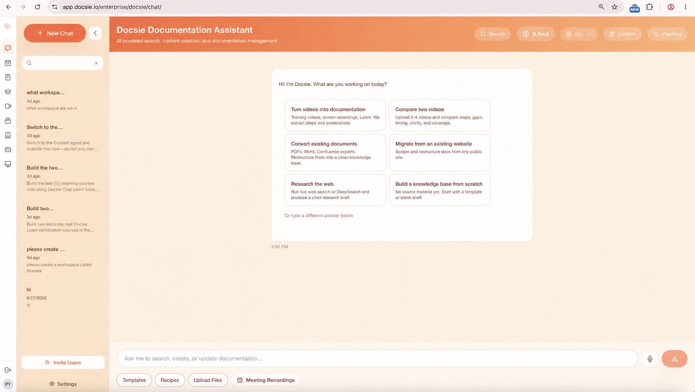
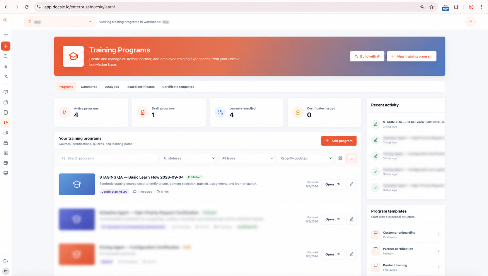
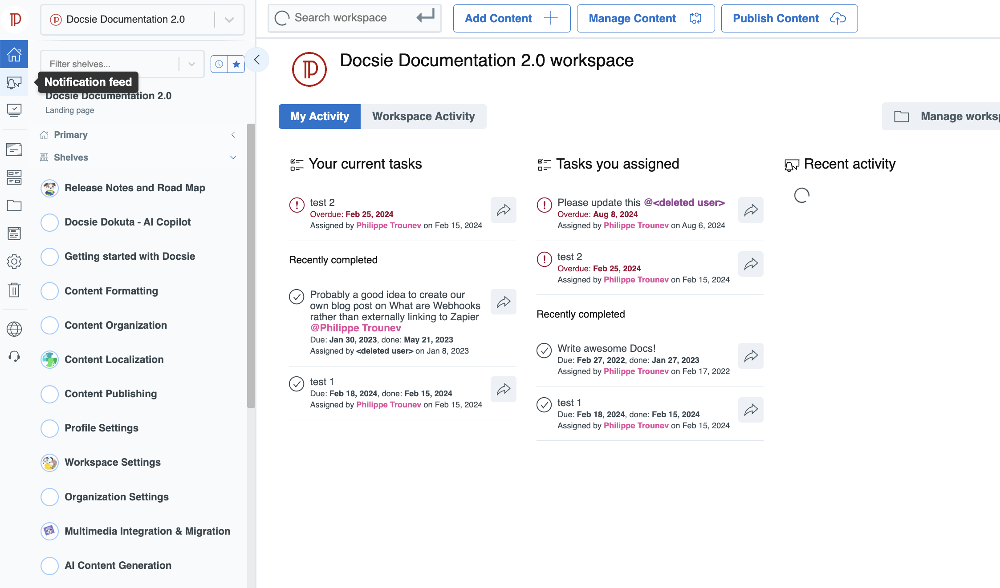
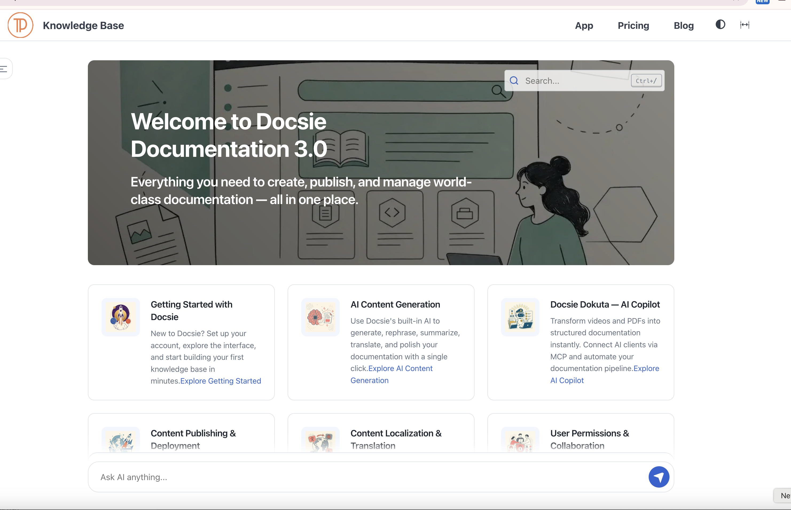

# Docsie Self-Hosted

**Documentation · AI knowledge workflows · Training — on your infrastructure**

[Website](https://www.docsie.io/) · [Install](#start-here) · [Documentation](docs/README.md) · [Agent setup](AGENTS.md) · [Releases](https://github.com/LikaloLLC/docsie-self-hosted/releases) · [Support](#support)

[](https://github.com/LikaloLLC/docsie-self-hosted/actions/workflows/validate.yml)

Docsie is a platform for creating, managing, translating and publishing knowledge,
turning source material into documentation, comparing content, delivering training,
and automating documentation workflows. Deploy the proprietary application on
Kubernetes you control, with your choice of local or hosted AI services.



> **Kubernetes preview:** charts and deployment tooling are public; compatible
> application images currently require [access from Docsie](https://www.docsie.io/demo/).
> See [release status](docs/RELEASE_STATUS.md) for what is included and tested.

**Explore:** [Use cases](#what-you-can-use-docsie-for) · [Screenshots](#screenshots) ·
[Availability](#which-parts-can-i-install-today) · [Install](#start-here) ·
[License](#license-and-access) · [Roadmap](#roadmap)

## What you can use Docsie for

Docsie connects documentation, source analysis, training and the workflows that
keep organizational knowledge useful. Teams can work from existing documents,
recordings and websites, develop that material into maintained content, publish
it to the right audience, and use it for answers, learning and review.

### Product documentation, help centers and internal knowledge bases

Create product manuals, implementation guides, support articles, employee
handbooks, runbooks and standard operating procedures. Organize them into
workspaces, shelves, books and articles, then publish public documentation or
controlled-access portals for employees, customers and partners. Custom domains
and branded portals let each audience access the documentation in its own context.

**Example:** maintain a customer help center and a private engineering runbook
from the same documentation platform, with different access rules.

### Multilingual documentation and product versions

Maintain documentation for different product releases and languages. Translate
content, refresh translations when the source changes, and maintain glossaries
and style guides so teams use consistent terminology.

**Example:** publish installation instructions for two supported product versions
in several languages without treating every copy as an unrelated document.

### Import, consolidate and maintain existing knowledge

Bring existing PDFs, Word documents, Markdown and Confluence content into an
editable knowledge base. Use AI-assisted writing and rewriting to organize raw
material into articles, manuals and procedures. Preserve the source material for
review and update the resulting documentation as requirements change.

**Example:** consolidate a folder of legacy manuals into structured product
documentation that your team can maintain and publish.

### Video-to-docs and operational knowledge capture

Turn recorded demonstrations, software walkthroughs and training videos into
step-by-step guides with screenshots. Dokuta supplies the video-processing
pipeline, with vision analysis and transcription for narrated material.
Meeting-recording integrations can also capture material for follow-up processing.

**Example:** record an experienced operator demonstrating a procedure, generate a
draft guide, review its steps and screenshots, and publish it for the next shift.

### AI search, questions and documentation agents

Ask questions over documentation, retrieve supporting sources and use agents to
create, edit, organize and publish content. Scope the work to the relevant
workspace or documentation rather than treating all company information as one
undifferentiated collection.

**Example:** help a support engineer answer a configuration question using the
product documentation, then improve the article that was missing an explanation.

### Content comparison, technical research and change analysis

Compare documents, videos and website-derived material. Investigate differences
between versions or compare different products, specifications and procedures.
Use structured findings and source references to explore the evidence and save
comparison results as documentation.

**Example:** compare two vendors' technical manuals against the requirements your
engineering team cares about, or inspect how a recorded workflow changed between
software releases. The useful outcome is an explained difference with evidence,
not simply a list of changed words.

### Docsie Learn: onboarding, training and certification

Build learning courses from documentation, arrange modules and learning paths,
assign them to an audience and track learner progress. Combine reading material
with quizzes, assessments and certification workflows. Course export tooling also
includes SCORM; compatibility with the intended LMS must be checked for the
selected application build.

**Example:** turn your operating procedures into employee onboarding with ordered
lessons and knowledge checks, or deliver product training to customers and partners.

### Forms, quizzes, surveys and assessments

Create and publish forms alongside your knowledge content, collect submissions,
and use quizzes or assessments to check understanding. Forms can support training
as well as operational information collection.

**Example:** attach a knowledge check to a procedure or collect structured feedback
from readers about an onboarding guide.

### Policy and compliance review

Analyze text, audio or video against supplied policies and review the resulting
findings. Combine policy documentation, operational evidence and training so the
people reviewing a procedure can trace the material behind a finding.

**Example:** review a recorded procedure against your organization's documented
requirements and use the findings to guide a human review and documentation update.
This is a review workflow; generated findings do not confer regulatory certification.

### Documentation workflows and automation

Coordinate work with workflow boards, steps and statuses. Run reusable workflow
recipes for repeated documentation operations and use agents to perform scoped
actions. API and MCP integrations let other applications and AI clients search
knowledge and participate in content-generation and publishing workflows.

**Example:** repeat an import, review and publishing process for a series of
manuals, or connect an AI client to your documentation through an authenticated
self-hosted endpoint.

### Narration, voice agents and presentations

Generate speech from text with Chatterbox or hosted TTS providers. Voice-agent
and presentation integrations extend this into interactive spoken experiences;
these require the corresponding media services and agent workers in addition to
the knowledge base and models.

**Example:** produce spoken training material or configure a conversational agent
for a guided session. Audio-file generation and a live voice conversation have
different deployment requirements.

## Screenshots

Explore the authoring workspace, published knowledge base and training dashboard.
These product screenshots illustrate the application; consult the availability
table below for the components included in the self-hosted preview.

<details>
<summary><strong>Docsie Learn — programs, learners, quizzes and certificates</strong></summary>



</details>

<details>
<summary><strong>Workspace — organize content, assignments and publishing</strong></summary>



</details>

<details>
<summary><strong>Knowledge base — branded documentation and AI assistance</strong></summary>



</details>

## Which parts can I install today?

The use cases above describe Docsie's application capabilities. This repository
packages them for self-hosting in stages; a feature present in application source
is not automatically included or verified in the published image/chart release.

| Area | Self-hosted distribution status |
| --- | --- |
| Core knowledge base and baseline services | Published Kubernetes preview; compatible registry image access required |
| Local or hosted AI | Configuration procedures available; verify the selected models and organization routing |
| Dokuta/video processing | Development full-stack chart; complete downloadable image set still pending |
| Local transcription | External Whisper-compatible endpoint supported; server/model bundle pending |
| Local TTS and interactive voice | Chatterbox, LiveKit and worker packaging/wiring pending; Dokuta voice APIs disabled by default |
| Learn, Forms, multilingual workflows, comparison, policy review and automation | Application capabilities; verify image version, feature configuration and dependencies for the chosen workflow; no separately qualified public presets yet |
| Meeting capture and external integrations | Require their own services, credentials and network access; not bundled by the baseline chart |
| AWS one-click and complete offline bundle | Not released |

Choose local, hosted or mixed providers independently for text, vision,
embeddings, transcription and speech. For a local-only deployment, verify the
entire route, including fallbacks, downloaded models and browser assets.

## Tell your installation agent the outcome you want

You do not need to choose a Helm profile first. For example:

> Install Docsie for internal SOPs, employee training and quizzes. Use our existing
> Kubernetes cluster and local models. Read AGENTS.md, identify the required image
> versions and components, prepare the configuration, and verify publishing plus
> a learner completing a lesson and quiz. Report anything not packaged yet.

Or:

> We want to turn recorded walkthroughs into guides and compare new versions.
> Use our Ollama server and local transcription endpoint. Check the required
> images and install the available services into our chosen namespace.

[AGENTS.md](AGENTS.md) tells agents how to select a target, prepare configuration,
install and verify the result. [Use-case procedures](docs/INSTALL_BY_USE_CASE.md)
map outcomes to dependencies and acceptance checks. Multiple use cases should
share one Docsie installation where appropriate.

## Start here

Installing with an AI coding agent? Point it at [AGENTS.md](AGENTS.md) for the
installation workflow, configuration choices and verification steps.

1. [Request image access](https://www.docsie.io/demo/) for a personal installation
   or business evaluation.
2. Follow [Kubernetes installation](docs/INSTALL_KUBERNETES.md).
3. Follow [Install Docsie with Ollama](docs/LOCAL_MODELS.md) for the complete walkthrough, or adapt it to another local model server.
4. Run the [acceptance checklist](docs/ACCEPTANCE.md) for your workflows.

```bash
git clone https://github.com/LikaloLLC/docsie-self-hosted.git
cd docsie-self-hosted
git checkout v0.2.0-preview.2
# Configure image access, hostname, TLS, storage and an administrator first.
bash scripts/install-kubernetes.sh /path/to/kubeconfig docsie /path/to/values.yaml
```

The baseline chart includes PostgreSQL, Redis, MinIO, Elasticsearch, web/worker
processes and document/image converters. Target production architecture is Linux
x86_64; the documented Mac rehearsal uses emulation and locally prepared images.

## Downloads

[Releases](https://github.com/LikaloLLC/docsie-self-hosted/releases) provide the
application chart, platform chart, Helm repository index and SHA-256 checksums.
The platform package bundles chart dependencies. Download and install its `.tgz`
with your values file, or use the source installer above.

```bash
sha256sum -c SHA256SUMS
helm upgrade --install docsie ./docsie-platform-0.2.0-preview.1.tgz \
  --kubeconfig /path/to/kubeconfig --namespace docsie --create-namespace \
  -f /path/to/values.yaml --wait --timeout 20m
```

## License and access

Docsie is **not open source**. Public deployment tooling does not change the
application license. Personal non-commercial use is free; business evaluation
is 30 days for up to 100 application users; continued commercial use requires a
paid license. Infrastructure and model inference are supplied by the operator.
See [licensing](docs/LICENSING.md) and [distribution notice](LICENSE).

## Roadmap

AWS provisioning is the next separate milestone. The inherited `installers/aws`
scaffolding is experimental and not a supported deployment path in this release.
Do not treat it as a verified one-click installer. Full offline bundles,
production backup/restore qualification and marketplace listings follow later.

## Development

```bash
python3 -m pip install -r requirements-dev.txt
bash scripts/package-release.sh
```

See [release status](docs/RELEASE_STATUS.md) for the exact verification boundary.

## Unreleased full-stack work

The development chart includes Dokuta bootstrap and configuration repairs from
a local full-stack rehearsal. See [full-stack validation](docs/FULL_STACK_VALIDATION.md)
for what passed and the remaining image, audio and licensing gates. This work
does not change the verification scope of the published release above.

## Documentation

Start at the [documentation index](docs/README.md) for installation, model
configuration, use-case procedures, troubleshooting and validation reports.

## Support

- **Image access, licensing and deployment assistance:** [contact Docsie](https://www.docsie.io/demo/).
- **Chart bugs or documentation fixes:** [open an issue](https://github.com/LikaloLLC/docsie-self-hosted/issues).
  Include chart/image versions, Kubernetes version, architecture and redacted error output.
- **Installation problems:** follow [troubleshooting](docs/TROUBLESHOOTING.md).

For changes to this distribution, see [CONTRIBUTING.md](CONTRIBUTING.md).
